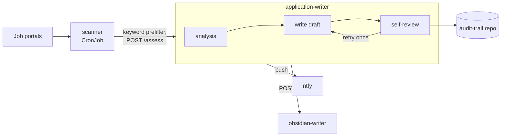

# agentic-job-scout

I got tired of manually checking freelance portals every day, so I built a pipeline that does it for me. It watches a handful of job boards, evaluates each posting against a candidate profile through a role-specific LLM pipeline (assessment, drafting, factual review, blind scoring), and for the good matches drafts a tailored CV and cover letter. I still read and send everything myself -- nothing goes out without me looking at it first.

It runs as three small services on Kubernetes, deployed via GitOps, rather than one script -- I wanted a real system with actual service boundaries, not a cron job full of `if` statements.

## How it works

A CronJob (`scanner`) checks the configured portals on a schedule and filters postings by keyword. Anything that clears that filter gets sent to `application-writer`, a FastAPI service that asks an LLM whether it's actually a good match against a written profile of my background -- real judgment, not just keyword scoring. Things like "only AI-security roles" or "remote-only for permanent positions" live in that profile as plain prose, the way I'd explain them to a recruiter.

For a strong match, the same service drafts a CV and cover letter, then runs a second LLM pass over its own draft to check that every claim actually traces back to something real, and rewrites once if it doesn't hold up. Anything still shaky gets flagged `needs-review` instead of `composed` -- I read everything before it's sent. Every draft is committed to a separate repo as a running history of what got generated and when. A third service, `obsidian-writer`, writes a note per application into my own notes so I have it there too.



This is a deterministic, role-separated LLM workflow, not an autonomous multi-agent system -- each stage has a fixed job, a structured output, and a bounded retry, rather than agents planning their own steps or picking their own tools.

## A concrete example (illustrative)

- **Posting**: "Senior Platform Engineer -- Remote, AI/LLM infrastructure, Kubernetes, Security"
- **Assessment**: `fit_level: stark`, match score 82% -- the posting clears the candidate profile's platform/security/AI criteria.
- **Draft**: a short, role-anchored cover letter with one concrete project example, plus a CV tailored to foreground the matching experience.
- **Review**: every claim checked against the source CV, verdict `APPROVE`. Status: `composed`, ready for a human to read and send.

## Make it yours

Everything specific to a candidate -- background, hard requirements, edge cases -- lives in one file: `application_writer/rules/candidate-profile.md`. The LLM reads it as context before judging or drafting anything. Swap that file (and the keywords in `config.yaml`) and the same pipeline runs for someone else, no code changes needed.

The version in this repo is a sanitized example, not my real profile -- name, rate, and client history are placeholders. The logic is the real thing though.

## Running it

This repo is a reference deployment of a system that actually runs in production for me -- not a turnkey demo. The full stack (`just compose-up`) needs things beyond this repo: sibling checkouts for the CV source and audit-trail repos, a working `claude` CLI session, and a reachable notification service. The fastest way to see the actual logic without standing any of that up:

```sh
just venv    # install deps for all three services
just test    # run the full test suite against fixtures -- no live portals, no live LLM calls
```

Config lives in `config.yaml` (committed) with a gitignored `config.local.yaml` for local overrides. Secrets come from `.env` locally and Kubernetes Secrets in the cluster (`k8s/secrets.md` has the one-time bootstrap steps). Deploys go through a kustomize base under `k8s/`, checked with `just k8s-validate`. LLM calls go through an authenticated CLI session rather than a raw API key.

## A few things worth knowing

Applications aren't auto-submitted -- I always read and send them myself. Portal connectors use authenticated browser sessions where required, and users are responsible for complying with each portal's terms and access policies; the fetcher docstrings in `scanner/fetchers/` have the site-specific details. The scanner is pinned to a specific node in my home cluster, so it's tuned for my setup rather than a drop-in deploy elsewhere.

MIT licensed, see [LICENSE](LICENSE).
