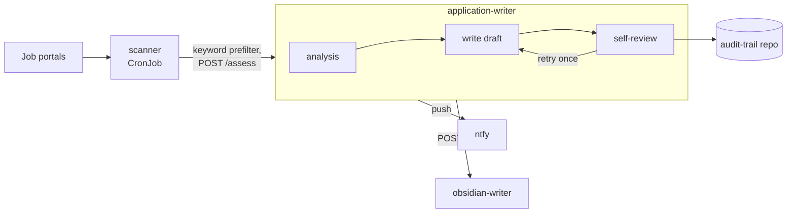

# agentic-job-scout

[](https://github.com/charemma/agentic-job-scout/actions/workflows/build.yml)

Agentic Job Scout is a self-hosted LLM pipeline I built to improve my own job-search and application workflow while deepening my practical experience with LLM-based systems.

The project turns a recurring manual process into a structured, traceable workflow: it collects new job postings, evaluates them against a configurable candidate profile, and prepares tailored application drafts for promising matches. Analysis, drafting, factual review, and blind scoring are implemented as separate LLM stages with structured outputs and bounded feedback loops. Every application remains subject to human review; the system supports the process but never submits anything automatically.

The project combines process optimization with hands-on AI engineering. It provides a concrete environment for experimenting with prompt and context engineering, LLM evaluation, service integration, controlled feedback loops, and the operation of AI workloads on Kubernetes. The system runs continuously on my self-hosted infrastructure as three containerized services deployed through GitOps.

## What it does

- Collects new job postings from multiple portals on a configurable schedule.
- Uses a keyword prefilter followed by an LLM-based fit assessment against a written candidate profile and selection criteria.
- Creates tailored CV and cover-letter drafts for strong matches.
- Reviews generated claims against the source profile and retries the drafting step once when necessary.
- Performs a separate blind-scoring pass to identify real gaps and honestly improvable wording.
- Flags unresolved issues as `needs-review`.
- Commits generated artifacts to a version-controlled audit trail.
- Keeps candidate background, hard requirements, and selection criteria separate from the application code.

## How it works

A CronJob (`scanner`) checks the configured portals on a schedule and filters postings by keyword. Anything that clears that filter gets sent to `application-writer`, a FastAPI service that asks an LLM whether it's actually a good match against the candidate profile -- real judgment, not just keyword scoring. Things like "only AI-security roles" or "remote-only for permanent positions" live in that profile as plain prose, the way I'd explain them to a recruiter.

For a strong match, the same service drafts a CV and cover letter, then runs a second LLM pass over its own draft to check that every claim actually traces back to something real, and rewrites once if it doesn't hold up. A third service, `obsidian-writer`, writes a note per application into my own notes.



This is a deterministic, role-separated LLM workflow, not an autonomous multi-agent system -- each stage has a fixed job, a structured output, and a bounded retry, rather than agents planning their own steps or picking their own tools.

## A concrete example (illustrative)

- **Posting**: "Senior Platform Engineer -- Remote, AI/LLM infrastructure, Kubernetes, Security"
- **Assessment**: `fit_level: stark`, match score 82% -- the posting clears the candidate profile's platform/security/AI criteria.
- **Draft**: a short, role-anchored cover letter with one concrete project example, plus a CV tailored to foreground the matching experience.
- **Review**: every claim checked against the source CV, verdict `APPROVE`. Status: `composed`, ready for a human to read and send.

## Make it yours

Everything specific to a candidate -- background, hard requirements, edge cases -- lives in one file: `application_writer/rules/candidate-profile.md`. The LLM reads it as context before judging or drafting anything. Swap that file (and the keywords in `config.yaml`) and the same pipeline runs for someone else, no code changes needed.

The version in this repo is a sanitized example, not my real profile -- name, rate, and client history are placeholders. The logic is the real thing though.

## Choosing the LLM backend

`pipeline.py` doesn't know what provider or CLI it's talking to -- it asks a small router for "the backend configured for this stage" (`analysis`, `writing`, `review`, `scoring`) and gets back a normalized result. Which backend and model each stage uses is a `config.yaml` change, under `llm:`:

```yaml
llm:
  backends:
    claude:
      type: claude-cli
      model: sonnet
      timeout_seconds: 180
  stages:
    analysis: claude
    writing: claude
    review: claude
    scoring: claude
```

Every stage uses `ClaudeCliBackend` by default, which shells out to `claude -p` and bills against a Claude Code subscription rather than a metered API. That's a deliberate choice for what this actually is -- one person's low-volume personal pipeline, not a shared service. A `CodexCliBackend` also exists (same idea, `codex exec` instead) if you want to route a stage to a different model for comparison; see `application_writer/llm/codex_cli_backend.py` for the caveats (Codex has no pure completion-only mode, unlike Claude's `--tools ""`). API-key-based backends for shared or high-volume deployments are planned but not built yet -- see [ROADMAP.md](ROADMAP.md).

## Running it

This repo is a reference deployment of a system that actually runs in production for me -- not a turnkey demo. The full stack (`just compose-up`) needs things beyond this repo: sibling checkouts for the CV source and audit-trail repos, a working `claude` CLI session, and a reachable notification service. The fastest way to see the actual logic without standing any of that up:

```sh
just venv    # install deps for all three services
just test    # run the full test suite against fixtures -- no live portals, no live LLM calls
```

Config lives in `config.yaml` (committed) with a gitignored `config.local.yaml` for local overrides. Secrets come from `.env` locally and Kubernetes Secrets in the cluster (`k8s/secrets.md` has the one-time bootstrap steps). Deploys go through a kustomize base under `k8s/`, checked with `just k8s-validate`. LLM calls go through an authenticated CLI session rather than a raw API key.

## A few things worth knowing

Applications aren't auto-submitted -- I always read and send them myself. Portal connectors use authenticated browser sessions where required, and users are responsible for complying with each portal's terms and access policies; the fetcher docstrings in `scanner/fetchers/` have the site-specific details. The scanner is pinned to a specific node in my home cluster, so it's tuned for my setup rather than a drop-in deploy elsewhere.

MIT licensed, see [LICENSE](LICENSE).
